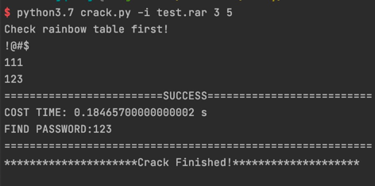

# force-cracker
For cracking some file that forget the pwd, currently support rar crack in Macox

## Preface
- Q: How does it crack rar file?
    >Well, firstly, it will use the **rainbow table** which contains a huge number of pwd to crack, if it failed, then use 
  > enumeration of pwd
- Q: What else compressed file support?
  > As is so far, just support rar,zip，and zip crack is not tested

## Usage
### Step 1
In order to support unpack rar file in MacOs, you need to execute in terminal with command `brew install unrar`

### Step 2
In the terminal, execute command `pip3 install -r requirements.txt`

### Step 3
cd into the project dir, execute with command `python3 -i test.rar 3 5 crack.py`, to check if the 
code is worked!

### Step 4
you can execute like step3 above, specifying the dest rar file, the numbers of pwd length is optional.

## Declaration 
This is not for commercial use, it's just for personal and educational use.

## Reference
[1] https://github.com/mnismt/CompressedCrack